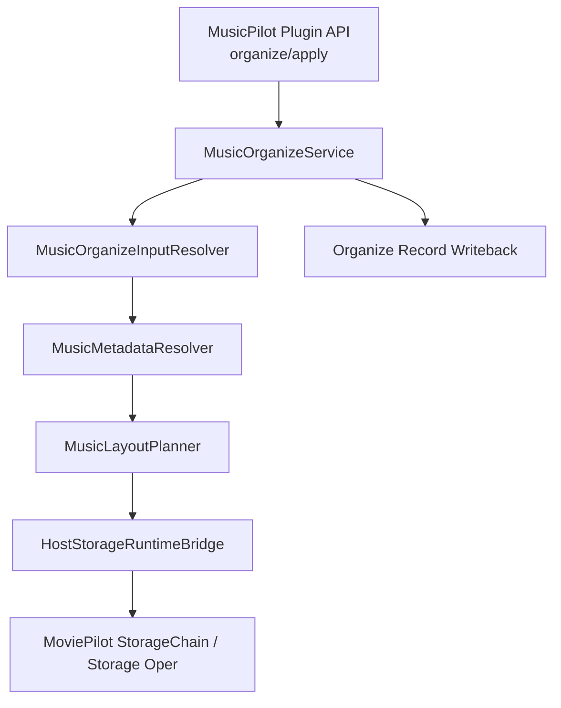

# 23. 音乐文件整理技术设计与实现方案

## 目标

为 MusicPilot 设计一条真正面向“音乐文件整理”的主路径。

这条路径需要满足：

- MusicPilot 只处理音乐语义，不再依赖 MoviePilot 的影视 `MediaInfo / MediaType / manual_transfer(...)` 识别链
- 继续复用宿主已经成熟的底层文件/存储操作能力
- 保持 `插件前端 -> MusicPilot 插件 API` 边界不变
- 搜索、下载、history、path handoff 不在本方案内调整

## 非目标

本方案不包含：

- preview 迁移
- 搜索/下载/history 主链路重写
- get_module 全量接管宿主 organize
- 将音乐 organize 伪装成影视 organize

## 一、问题归纳

当前 `organize apply` 走的是：

- `RealOrganizeAdapter.apply()`
- `HostTransferRuntimeBridge.manual_transfer()`
- `TransferChain.manual_transfer(...)`

这个路径的问题不是“参数还差一点”，而是上层语义天然偏影视：

- `MediaType` 只有 `MOVIE / TV / COLLECTION / UNKNOWN`
- `MediaInfo` 结构以 `tmdb_id / tvdb_id / douban_id / season / episode` 为核心
- `RENAME_FORMAT(...)` 只有电影/电视剧两套模板
- `MediaChain` / TMDB / 豆瓣识别链都是影视语义

因此：

- 继续补 `tmdbid / doubanid / mtype`
- 或继续用 `manual_transfer(...)`

只能让宿主更好地整理“影视”，不能自然变成“音乐整理”。

## 二、设计原则

### 2.1 语义分层

音乐 organize 拆成三层：

1. 音乐元数据层
   - 从音频标签、文件名、目录名、已有上下文中恢复音乐元数据
2. 音乐命名/路径规划层
   - 根据音乐元数据生成目标目录与目标文件名
3. 文件执行层
   - 使用宿主底层文件/存储能力执行 copy/move/link/softlink

### 2.2 复用边界

可直接复用的宿主能力：

- `StorageChain.get_file_item(...)`
- `StorageChain.support_transtype(...)`
- 存储操作对象的：
  - `get_folder(...)`
  - `get_item(...)`
  - `copy(...)`
  - `move(...)`
  - `link(...)`
  - `softlink(...)`

不应继续复用的宿主能力：

- `TransferChain.manual_transfer(...)`
- `MediaChain.recognize_media(...)`
- 影视 `MediaInfo`
- `settings.RENAME_FORMAT(MediaType)`
- 影视重命名字典与 TMDB/豆瓣识别链

## 三、目标架构



## 三点五、当前已实现的 MVP 边界

当前仓库已经落地了最小版 `organize apply` 音乐执行层：

- `preview` 已本地化为 MusicPilot 的本地音乐 plan preview
- `apply` 不再调用 `TransferChain.manual_transfer(...)`
- `apply` 当前改为通过 `HostStorageRuntimeBridge` 在宿主进程内复用宿主底层文件/存储操作

当前 MVP 的实现边界：

- 只支持单文件输入
- 只支持 `local -> local`
- 继续复用现有 `OrganizeStrategyService` 生成音乐目标路径
- 继续由 MusicPilot 负责：
  - organize input 解析
  - 音乐路径规划
  - organize record 回写

也就是说，这份设计文档里“三层拆分”的方向已经开始落地，但目前只实现到了：

- 上层仍复用现有 MusicPilot organize service / strategy
- 下层只落地了 `HostStorageRuntimeBridge` 这条宿主底层执行桥接
- 独立的 `MusicMetadataResolver / MusicLayoutPlanner` 还没有单独拆成新模块

当前这条 bridge 已经完成插件正式化收口：

- 不再依赖 `_resolve_host_root()`
- 不再使用 `subprocess + python -c`
- 不再通过 `sys.path` 人工注入宿主源码
- 改为在宿主进程内直接访问 host `filemanager` 模块

### 三点六、当前已完成的 metadata resolver 抽离

当前仓库已经把原先混在 `OrganizeStrategyService` 里的“音乐元数据恢复”逻辑拆成了独立的 `MusicMetadataResolver`：

- `MusicMetadataResolver`
  - 负责从 `SearchCandidateDetail + MetadataDetail` 恢复 `artist/album/title/year/format`
- `OrganizeStrategyService`
  - 继续保留为薄壳 planner
  - 负责 snapshot 构造、相对路径选择和模板渲染

这一步的目标不是增强元数据来源，而是先把“音乐元数据恢复”和“路径规划”拆成两个清晰边界，方便后续再独立演进 `MusicLayoutPlanner`。

### 3.1 MusicOrganizeInputResolver

职责：

- 从现有 `candidate / binding / path_handoff` 恢复 organize 输入
- 不改变现有 API 请求结构
- 仍然只接受当前的 `organize_job_id`

输入：

- `source_path`
- `source_storage`
- `source_filetype`
- `binding`
- `candidate.raw_payload`
- `path_handoff`

输出：

- `MusicOrganizeInput`

### 3.2 MusicMetadataResolver

职责：

- 不再做影视媒体识别
- 只做音乐元数据恢复

建议的解析顺序：

1. 现有上下文中已存在的音乐元数据
2. 音频标签
   - ID3 / FLAC Vorbis Comment / MP4 tags
3. 文件名/目录名解析
4. 保底空值归一

第一版不要求接入在线音乐库。

只要能稳定拿到以下关键字段即可：

- `artist`
- `album_artist`
- `album`
- `title`
- `track_number`
- `disc_number`
- `year`

### 3.3 MusicLayoutPlanner

职责：

- 根据音乐元数据生成目标目录和目标文件名
- 不依赖宿主的电影/电视剧重命名模板

推荐最小布局：

- 单专辑：
  - `{album_artist}/{year} - {album}/{track:02d} - {title}{ext}`
- 多碟：
  - `{album_artist}/{year} - {album}/Disc {disc}/{track:02d} - {title}{ext}`
- 合辑：
  - `Various Artists/{year} - {album}/{track:02d} - {artist} - {title}{ext}`
- 信息缺失降级：
  - `Unknown Artist/Unknown Album/{basename}{ext}`

规划结果输出：

- `target_library_path`
- `target_relative_path`
- `target_file_name`
- `final_target_path`

### 3.4 HostStorageRuntimeBridge

职责：

- 不再调用 `TransferChain.manual_transfer(...)`
- 只负责：
  - 取源文件
  - 取目标目录
  - 校验整理方式
  - 执行 copy/move/link/softlink

第一版建议实现为一个很薄的宿主运行时桥接：

- 输入：
  - `source_fileitem`
  - `target_storage`
  - `target_directory`
  - `target_filename`
  - `transfer_type`
- 内部使用：
  - `StorageChain.get_file_item(...)`
  - `StorageChain.support_transtype(...)`
  - 目标存储操作对象 `get_folder(...)`
  - 存储操作对象 `copy/move/link/softlink(...)`

这样可以复用宿主底层文件能力，而不进入影视 organize 语义。

## 四、核心数据模型

### 4.1 MusicMetadata

```python
MusicMetadata(
    artist: str | None,
    album_artist: str | None,
    album: str | None,
    title: str | None,
    year: str | None,
    track_number: int | None,
    disc_number: int | None,
    genre: str | None,
    is_compilation: bool,
)
```

### 4.2 MusicOrganizeInput

```python
MusicOrganizeInput(
    source_path: str,
    source_storage: str,
    source_filetype: str,
    source_name: str,
    target_library_path: str,
    transfer_type: str,
    metadata: MusicMetadata,
)
```

### 4.3 MusicTransferPlan

```python
MusicTransferPlan(
    target_library_path: str,
    target_relative_path: str,
    target_file_name: str,
    final_target_path: str,
)
```

## 五、兼容性边界

保持不变：

- `POST /api/v1/plugin/musicpilot/organize/apply`
- `POST /api/v1/plugin/musicpilot/organize/preview`
- `organize_job_id` 作为 apply 输入
- path handoff 的职责
- history 的职责
- organize record 的写回结构
- 搜索/下载主链路

改变的只有一层：

- `RealOrganizeAdapter.apply()` 的宿主执行实现

从：

- 影视语义的 `TransferChain.manual_transfer(...)`

变为：

- 音乐语义的 `MusicLayoutPlanner + HostStorageRuntimeBridge`

## 六、为什么这条路兼容性最好

### 保住的兼容性

- 前端无需改
- API 无需改
- 现有 organize record 模型大体无需改
- path handoff/history 继续沿用
- 宿主底层文件能力继续复用

### 避免的破坏性

- 不需要把音乐硬塞进 `MediaType`
- 不需要改 TMDB / 豆瓣 / Bangumi 识别链
- 不需要重写宿主所有 organize 逻辑
- 不需要第一轮就上 `get_module()` 全接管

## 七、实现方案

### 第一步：引入音乐元数据模型

新增：

- `backend/app/schemas/music_organize.py`

内容：

- `MusicMetadata`
- `MusicOrganizeInput`
- `MusicTransferPlan`

### 第二步：实现音乐元数据恢复

新增：

- `backend/app/services/music_metadata.py`

职责：

- 从 `candidate.raw_payload` / `binding.raw_payload` / 音频标签 / 文件名恢复音乐元数据

第一版优先级：

1. 现有上下文
2. 音频标签
3. 文件名解析

### 第三步：实现音乐命名/路径规划

新增：

- `backend/app/services/music_layout.py`

职责：

- 根据 `MusicMetadata` 生成 `MusicTransferPlan`

第一版只支持 3 种场景：

- 普通专辑
- 多碟专辑
- 合辑

### 第四步：实现宿主底层文件桥接

新增：

- `backend/app/adapters/host_storage_runtime.py`

职责：

- 在隔离宿主解释器中执行：
  - `get_file_item`
  - `support_transtype`
  - `get_folder`
  - `copy/move/link/softlink`

输出：

- `success`
- `message`
- `target_item`

### 第五步：替换 apply 内部执行

修改：

- `backend/app/adapters/organize.py`

做法：

1. 保留现有 `organize_job_id -> record -> candidate -> path_handoff -> plan` 外壳
2. 在 `apply()` 内：
   - 不再构造影视 `manual_transfer(...)` 参数
   - 改为：
     - 构造 `MusicOrganizeInput`
     - 解析 `MusicMetadata`
     - 生成 `MusicTransferPlan`
     - 调用 `HostStorageRuntimeBridge`
3. 保持 `OrganizeAdapterResult` 结构不变

### 第六步：补最小测试

至少补：

- 音频标签解析成功
- 文件名解析降级成功
- 专辑/多碟/合辑路径规划
- copy/link 两种整理方式
- organize record 回写保持兼容

## 八、分阶段落地建议

### Phase A：音乐 organize MVP

范围：

- 本地文件
- `copy/link/softlink`
- 音频标签 + 文件名解析
- 单专辑/多碟/合辑

不做：

- 在线音乐库匹配
- preview 重写
- 复杂合集规则

### Phase B：增强识别

在 MVP 稳定后再补：

- MusicBrainz / Discogs / 网易云 / Apple Music 等外部元数据源
- 更细的专辑版本识别
- 多艺术家命名规则

### Phase C：插件机制深接入

如果后续需要更深复用宿主：

- 再评估 `StorageOperSelection`
- 再评估 `get_module()` 对底层存储操作的扩展

不是第一轮必需项。

## 九、最终建议

如果只做一个“既兼容、又最小、还能真正对齐音乐语义”的方案：

### 直接采用这条路径

- 放弃把音乐继续塞进 `TransferChain.manual_transfer(...)`
- 保留 MusicPilot 当前 organize API 外壳
- 复用宿主底层文件/存储能力
- 单独实现音乐元数据恢复与音乐命名规划

这条方案的核心不是“重写整个宿主”，而是：

- **只替换影视 organize 上层语义**
- **最大化复用宿主底层文件执行层**

这才是“少量扩展、又能保证兼容性”的正确落点。
